<p align="center">
  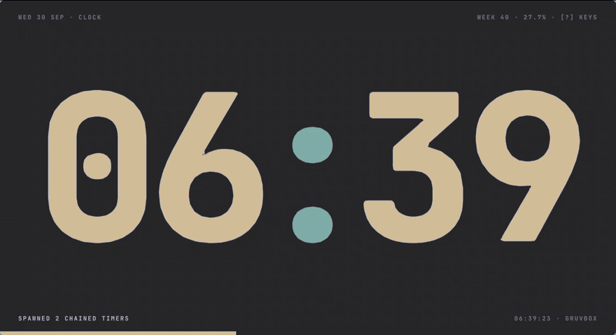
</p>

<h1 align="center">EPOCH</h1>
<p align="center"><b>One enormous time. Nothing else until you ask for it.</b><br>
A keyboard-first clock for <a href="https://omarchy.org">Omarchy</a>: alarms, timers, a stopwatch and world clocks, set in brutalist type that fills whatever tile you give it.</p>

---

## Why it's different

- **It wears your theme, live.** Epoch reads the active Omarchy theme, and when you switch themes it doesn't just repaint: every color eases to the new palette while an accent slab wipes across the window (above).
- **The type fills the tile.** There's no fixed type scale. Every number is sized to its box, and the layout changes with the window: a full tile, a half tile (hours stacked over minutes), a floating window, or a 240×90 widget pinned to every workspace.
- **A command bar, not forms.** Press `:` and type `t 25m tea`, `a 7:30 gym weekdays` or `w tokyo`, with autocomplete, ghost text and a dry run that tells you exactly what Enter will do.
- **Timers are processes.** Each one gets a PID. Chain them with `&&` (`t 25m work && t 5m break`) and the next one waits, queued, until the last one ends. `k` kills, `u` undoes.
- **Alarms you have to be awake to stop.** A ringing alarm takes over the window, flashing, until you type its label backwards. Escape doesn't work. You can snooze, and snooze rings again.
- **Always on.** Epoch keeps running with the window hidden, so alarms still ring. `SUPER + E` summons it.
- **Scriptable.** Anything the command bar understands also works from a terminal: `epoch t 12m eggs`.

## Screens

| | |
|---|---|
| 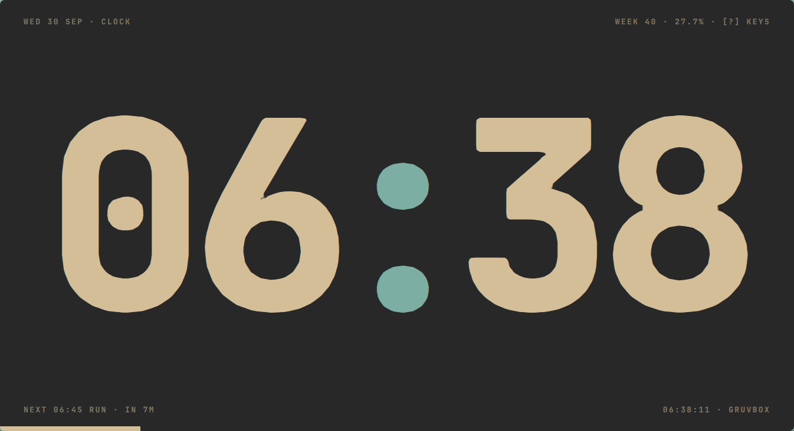 | 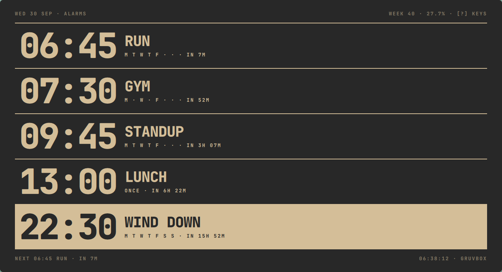 |
| **Clock** · the colon is the only color | **Alarms** · `space` arms and disarms; the selected row inverts |
| 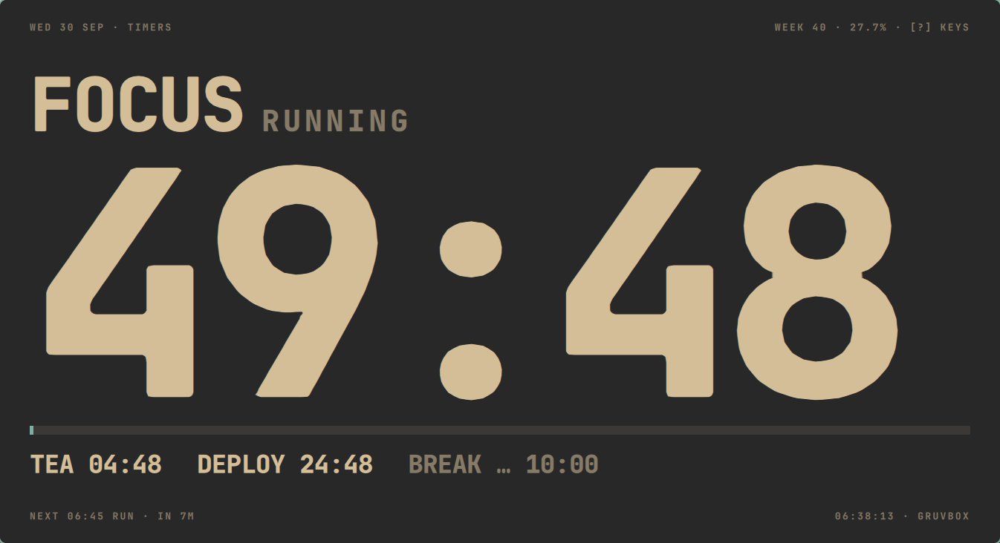 | 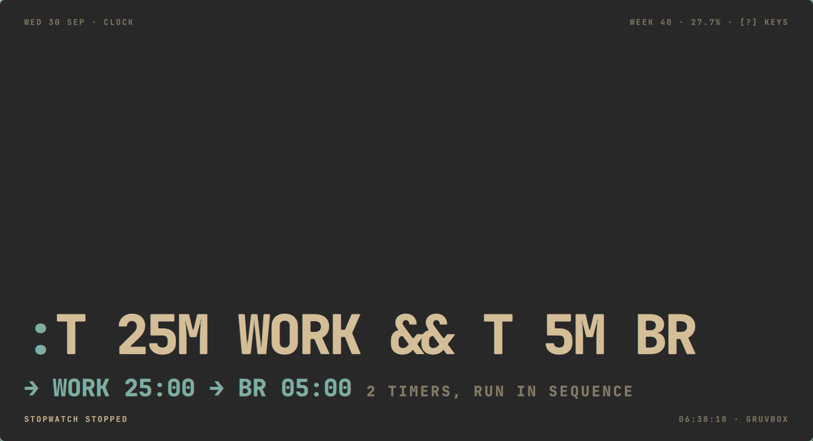 |
| **Timers** · the selected timer is the hero; others wrap below | **Command bar** · `:` with a live dry run |
| 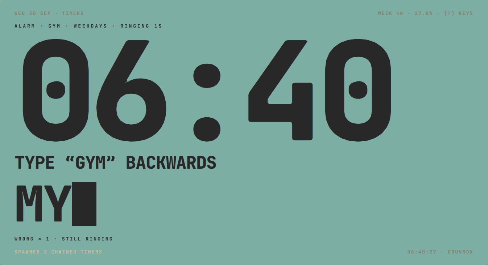 | 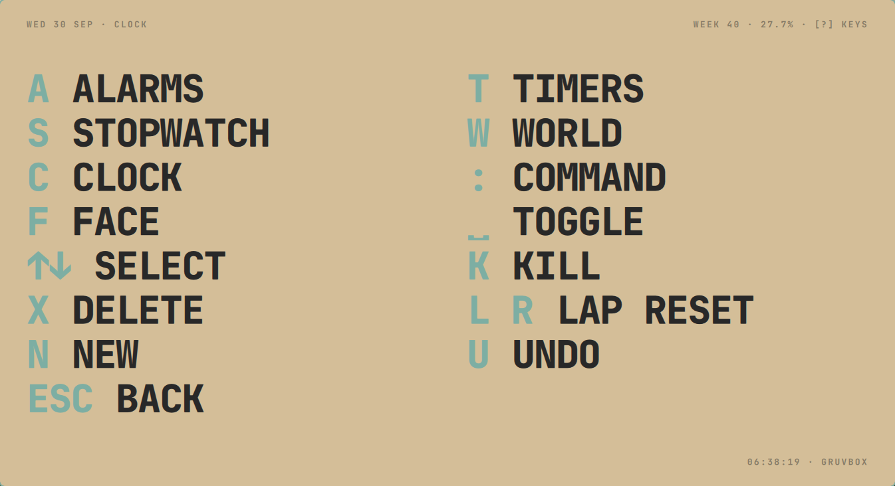 |
| **Ringing** · type it backwards; wrong answers shake | **Help** · `?` inverts the window |
| 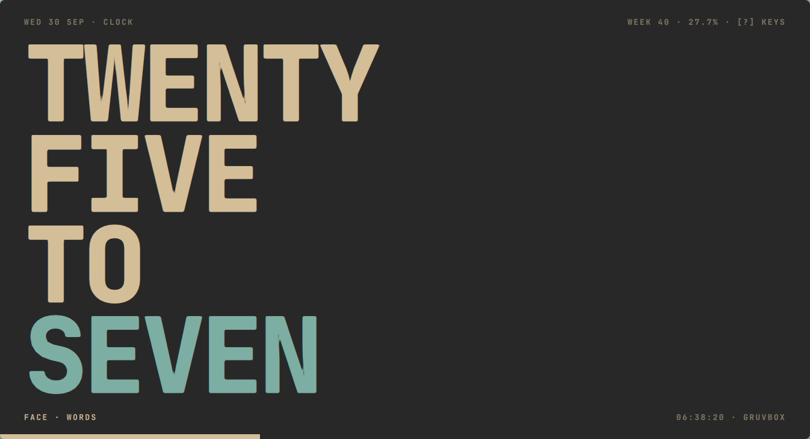 | 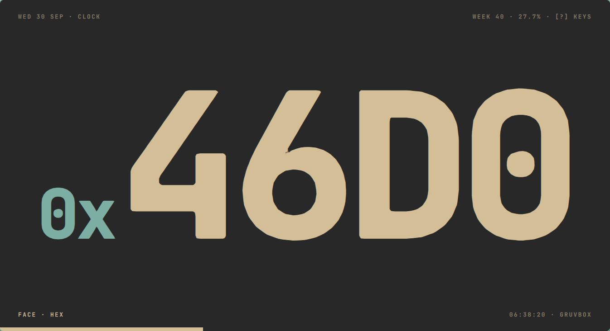 |
| **Words** face (`f`) | **Hex** face · the day as a fraction of `0xFFFF` |
| 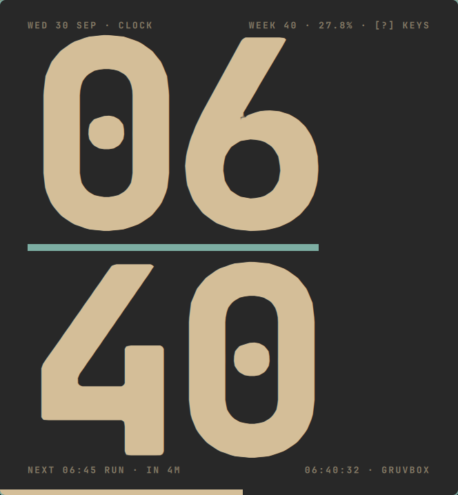 | 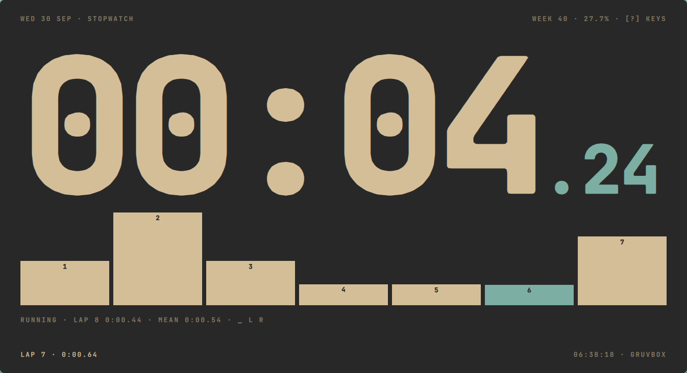 |
| **Half tile** · hours over minutes | **Stopwatch** · laps as bars, the best in accent |

And pinned (`SUPER + ALT + E`): 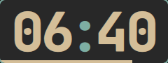

## Install

You need Omarchy, or another Hyprland setup with Quickshell. Epoch uses `qs`, `hyprctl`, `jq`, `pw-play` and `notify-send`, which an Omarchy install already has.

```bash
git clone https://github.com/CosmiCodeArcher/epoch ~/.local/share/epoch
~/.local/share/epoch/install.sh
```

The installer:
- links `epoch` into `~/.local/bin`
- adds Epoch to the app launcher
- on Omarchy's Lua Hyprland config, writes `~/.config/hypr/epoch.lua` and adds one `require` line to `hyprland.lua` (backing it up first). That file adds a solid-window rule, `SUPER + E` to toggle, `SUPER + ALT + E` to pin, and autostart.
- reloads Hyprland and checks for config errors.

Use `--no-hypr` to skip the Hyprland part, or `--uninstall` to remove everything. Your alarms and timers stay in `~/.local/state/epoch`.

## Keys

| Key | Does |
|---|---|
| `c` `a` `t` `s` `w` | clock · alarms · timers · stopwatch · world |
| `:` | command bar (`Tab` completes, `↑↓` picks, `Ctrl-W` / `Ctrl-U` erase) |
| `f` / `F` | next / previous face: digits, words, hex |
| `?` | help |
| `↑` `↓` `j` `k` | select a row (`k` kills on the timers screen) |
| `space` | pause a timer · arm an alarm · start the stopwatch |
| `x` | delete the selected timer, alarm or city |
| `+` `-` | add or take a minute from the selected timer |
| `r` · `l` | restart a timer or reset the stopwatch · lap |
| `n` | new (opens `:` prefilled for the screen you're on) |
| `u` | undo (30 deep) |
| `Esc` | back to the clock |

## Command language

| Command | Example |
|---|---|
| `t <dur> [name]` | `t 25m tea` · `t 1h30m` · `t 90s` · `t 4:30` · `t 25m work && t 5m break` |
| `a <time> [label] [days]` | `a 7:30 gym weekdays` · `a 6pm call` · `a 0645 run mon,wed,fri` · `a 22:15 read daily` |
| `w <city>` | `w tokyo` · `w sao` (53 cities, fuzzy matched) |
| `s [lap\|reset]` | start/stop, lap, reset the stopwatch |
| `k <pid\|name>` | `k 4121` · `k tea` |
| `f <face>` | `f words` |
| `theme <name>` | `theme tokyo-night` (runs `omarchy theme set`) |
| `ring` | test the alarm |

From a terminal: `epoch <command>`, plus `epoch toggle`, `epoch pin`, `epoch daemon`, `epoch quit` and `epoch --help`.

## How it's built

Epoch is a [Quickshell](https://quickshell.org) app, the same toolkit Omarchy's own bar is made with. It runs as one small background process.

```
core/engine.mjs              all state and the command language, no UI; plain JS, tested in Node
core/theme.mjs               colors.toml → 12 design tokens, OKLab mixing
core/App.qml                 drives the engine: ticking, saving, theme and time zones, sound, IPC
directions/monolith/         the Monolith design: layout.mjs (every sizing formula) + the views
ui/                          shared text component and the notification card
bin/epoch                    launcher and CLI
```

The UI is split into *directions*. Monolith is one of five designs made for Epoch; the others (Pane, Scope, Almanac and Dwindle) could be added later as new folders in `directions/`, all sharing the same engine.

## Development

```bash
node --test test/          # engine, parser, theme and layout tests
qs -p .                    # run from the repo in the foreground, with logs
scripts/demo.sh start      # a separate instance with demo data and its own state, for screenshots
```

## Credits

- The design was made with Claude Design: *Monolith*, one of five directions drafted for Epoch.
- Built with [Quickshell](https://quickshell.org).
- Type is [JetBrains Mono](https://www.jetbrains.com/lp/mono/) (SIL Open Font License; a copy of the ExtraBold, Bold and Regular weights ships in `assets/fonts`).
- Sounds are the freedesktop sound theme.

MIT licensed. See [LICENSE](LICENSE).
